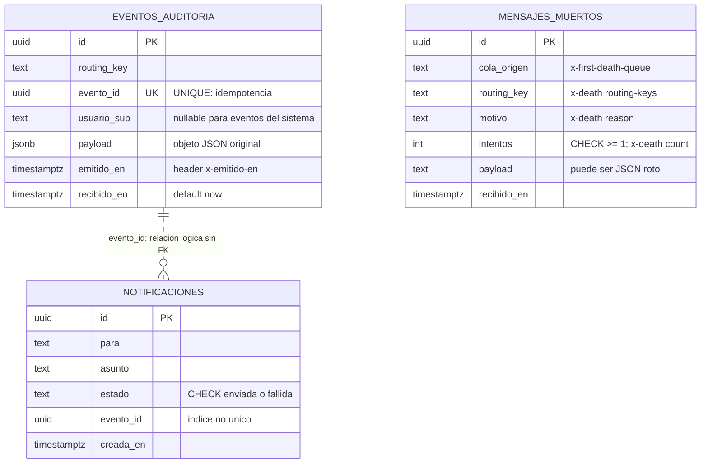
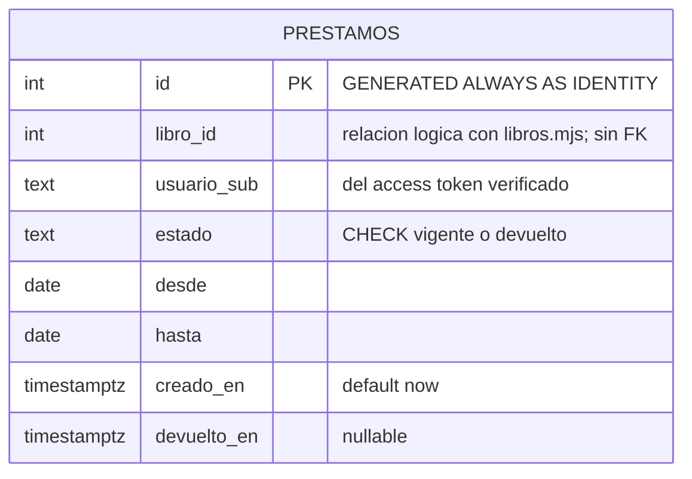
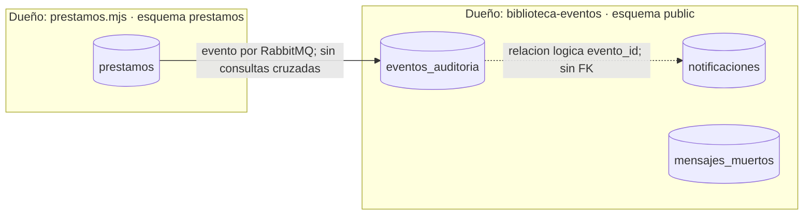

# Modelo de datos · biblioteca

Una instancia PostgreSQL, dos dueños. El worker escribe exclusivamente el esquema public
y prestamos.mjs exclusivamente el esquema prestamos. Los consumidores reciben los datos
que necesitan en el payload y no consultan las tablas del otro dueño.

## Dueño: biblioteca-eventos · esquema public

| Restricción o índice | Finalidad |
|---|---|
| uq_eventos_auditoria_evento_id: UNIQUE(evento_id) | Reentregas producen una sola fila; 23505 recibe ack |
| ix_eventos_auditoria_routing_recibido: (routing_key, recibido_en) | Filtrar tipo de evento y rango de tiempo |
| ix_notificaciones_evento_id: (evento_id), no único | Seguir todos los avisos de un evento |
| ck_notificaciones_estado: enviada o fallida | La regla se aplica también a SQL manual |
| ck_mensajes_muertos_intentos: intentos >= 1 | Siempre hubo al menos una muerte |
| NOT NULL salvo eventos_auditoria.usuario_sub | Datos obligatorios definidos por el contrato |

No hay FK de notificaciones a auditoría: ambos consumidores trabajan de forma independiente
y una notificación puede llegar antes del INSERT de auditoría.
La relación admite varias notificaciones para un mismo evento; no es una garantía de envío único.
Las PK uuid generan un ID de fila; evento_id lo genera el productor y viaja con el mensaje.
No hay índice en para porque las consultas del laboratorio no filtran por destinatario.
El usuario_sub de prestamo.creado/devuelto es el lector del préstamo; libro.agotado no trae usuario.

## Dueño: prestamos.mjs · esquema prestamos

| Restricción o índice | Finalidad |
|---|---|
| ck_prestamos_estado | Solo vigente o devuelto |
| uq_prestamos_vigente: UNIQUE(usuario_sub, libro_id) WHERE estado='vigente' | Impide dos préstamos vigentes incluso con peticiones concurrentes; permite pedirlo de nuevo después de devolver |
| ix_prestamos_usuario_sub | Listar préstamos del lector |
| Sin FK en libro_id | Catálogo pertenece a libros.mjs |

Las fechas desde/hasta son date y se devuelven como YYYY-MM-DD sin conversión de zona.
Los instantes son timestamptz para conservar el instante absoluto.
En la devolución, el UPDATE incluye usuario_sub y estado vigente, para aplicar la autorización
y evitar volver a publicar una devolución ya realizada.

## Frontera entre dueños

El payload de auditoría es jsonb porque ya pasó JSON.parse; el de mensajes muertos es text
porque precisamente puede no ser JSON. mensajes_taller de L6 es una tabla histórica,
no parte del modelo de ninguno de estos servicios.

El esquema SQL del productor es versionado y se aplica al arrancar con IF NOT EXISTS.
El worker sincroniza las entidades solo en desarrollo; en producción hacen falta migraciones.
