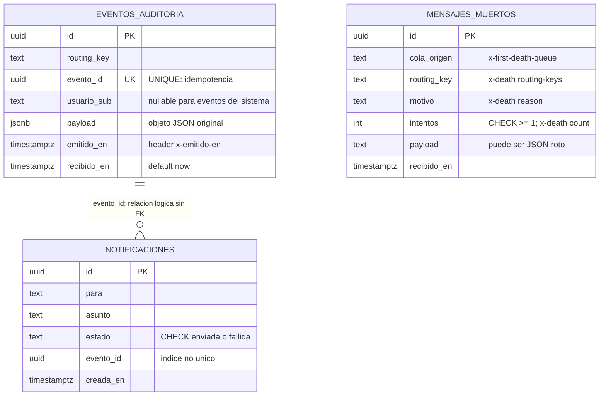
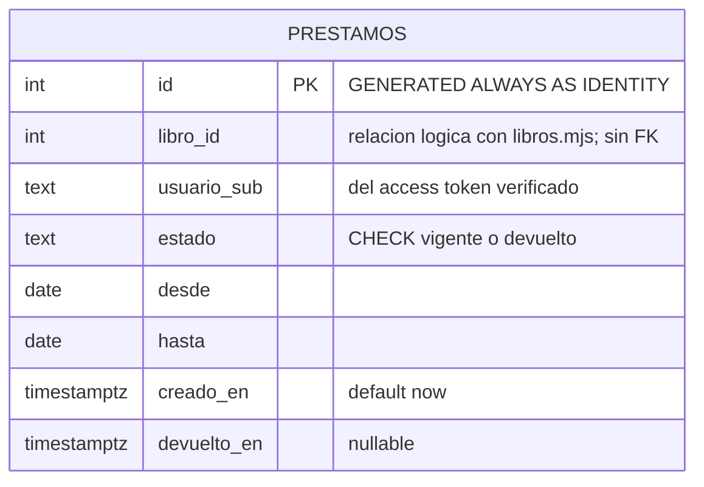
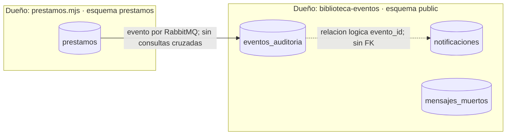

# Respuestas L7

Pruebas ejecutadas el 10 de octubre de 2026. Las salidas se conservan en biblioteca-plataforma/docs/evidencias-l7. Los logs de los contenedores muestran UTC; en Santiago la prueba de las 22:13 UTC fue a las 19:13.

La prueba de Angular se pospuso por decisión del usuario. El backend y la cadena de eventos están verificados; la prueba con su sesión de Cognito se realizará después.

## Respuesta 1

### 1 · docker compose ps

```text
NAME                     IMAGE                     COMMAND                  SERVICE     CREATED              STATUS                        PORTS
biblioteca-bff-1         biblioteca-bff            "docker-entrypoint.s…"   bff         About a minute ago   Up About a minute             0.0.0.0:3000->3000/tcp, [::]:3000->3000/tcp
biblioteca-eventos-1     biblioteca-eventos        "docker-entrypoint.s…"   eventos     7 seconds ago        Up 6 seconds (healthy)        0.0.0.0:3010->3010/tcp, [::]:3010->3010/tcp
biblioteca-gateway-1     biblioteca-gateway        "docker-entrypoint.s…"   gateway     About a minute ago   Up About a minute             0.0.0.0:8080->8080/tcp, [::]:8080->8080/tcp
biblioteca-libros-1      biblioteca-servicios:l7   "docker-entrypoint.s…"   libros      About a minute ago   Up About a minute             0.0.0.0:3001->3001/tcp, [::]:3001->3001/tcp
biblioteca-prestamos-1   biblioteca-servicios:l7   "docker-entrypoint.s…"   prestamos   58 seconds ago       Up 57 seconds (healthy)       0.0.0.0:3002->3002/tcp, [::]:3002->3002/tcp
biblioteca-web-1         biblioteca-web            "/docker-entrypoint.…"   web         About a minute ago   Up About a minute (healthy)   0.0.0.0:4200->80/tcp, [::]:4200->80/tcp
postgres                 postgres:18               "docker-entrypoint.s…"   postgres    3 minutes ago        Up 3 minutes (healthy)        0.0.0.0:5432->5432/tcp, [::]:5432->5432/tcp
rabbit1                  rabbitmq:4.3-management   "docker-entrypoint.s…"   rabbit1     2 minutes ago        Up 2 minutes (healthy)        0.0.0.0:5672->5672/tcp, [::]:5672->5672/tcp, 0.0.0.0:15672->15672/tcp, [::]:15672->15672/tcp
```

### 2 · Nodo antes y después

Antes: rabbit@rabbit1

Después: rabbit@rabbit1

### 3 · Colas después de recrear RabbitMQ

```text
Timeout: 60.0 seconds ...
Listing queues for vhost / ...
name	messages
auditoria	0
notificaciones	0
correos	0
```

### 4 · Por qué rechazó la conexión si resolvió el nombre

El contenedor ya había arrancado y DNS resolvía postgres, pero PostgreSQL aún no aceptaba conexiones TCP.

Experimento sin espera:

```text
cliente-1  | psql: error: connection to server at "postgres" (172.22.0.3), port 5432 failed: Connection refused
cliente-1  | 	Is the server running on that host and accepting TCP/IP connections?
```

Con service_healthy:

```text
cliente-1  |     resultado
cliente-1  | ------------------
cliente-1  |  la base contesto
cliente-1  | (1 row)
cliente-1  |
```

### 5 · Por qué depende el worker y no el gateway

Eventos y préstamos abren conexiones a Postgres/RabbitMQ al arrancar; el gateway llama a sus dependencias al atender peticiones.

## Respuesta 2

### 1 · Prefetch 1: name/messages/ready/unacked

```text
auditoria	5	4	1
```

### 2 · Después de matar el consumidor

```text
auditoria	5	5	0
```

Se usó docker kill sobre un consumidor temporal para provocar la pérdida del proceso sin ACK.

### 3 · Prefetch 5

```text
auditoria	5	0	5
```

### 4 · Escribe en la base y muere antes del ACK

RabbitMQ devuelve el mensaje a la cola y lo reentrega. La escritura puede repetirse; UNIQUE(evento_id) hace idempotente la auditoría y el duplicado recibe ACK.

### 5 · Prefetch 0

Significa sin límite de mensajes sin confirmar, no cero mensajes.

## Respuesta 3

### 1 · Los seis bindings

```text
biblioteca.eventos	notificaciones	prestamo.*
biblioteca.comandos	correos	correo.enviar
biblioteca.dlx	auditoria.dlq	auditoria
biblioteca.dlx	notificaciones.dlq	notificaciones
biblioteca.dlx	correos.dlq	correos
biblioteca.eventos	auditoria	#
```

### 2 · Colas después del payload roto

```text
Timeout: 60.0 seconds ...
Listing queues for vhost / ...
name	messages
notificaciones.dlq	1
auditoria	0
notificaciones	0
correos.dlq	0
auditoria.dlq	1
correos	0
```

El consumidor de cartas muertas estaba temporalmente pausado para observar las DLQ. Al activarlo, se guardan y las colas vuelven a cero.

### 3 · Headers con x-death

```text
cola: auditoria.dlq
routing key: auditoria
payload: { esto no es JSON valido
headers:
{
  "x-death": [
    {
      "count": 1,
      "reason": "rejected",
      "queue": "auditoria",
      "time": {
        "!": "timestamp",
        "value": 1791670262
      },
      "exchange": "biblioteca.eventos",
      "routing-keys": [
        "prestamo.creado"
      ]
    }
  ],
  "x-emitido-en": "2026-10-10T22:11:02.325Z",
  "x-evento-id": "73a4267f-4e0e-408e-a3ba-2e1634449d4f",
  "x-first-death-exchange": "biblioteca.eventos",
  "x-first-death-queue": "auditoria",
  "x-first-death-reason": "rejected",
  "x-last-death-exchange": "biblioteca.eventos",
  "x-last-death-queue": "auditoria",
  "x-last-death-reason": "rejected"
}
mensaje devuelto a auditoria.dlq: sigue ahi
```

### 4 · Por qué llegó a dos DLQ

prestamo.creado coincide con prestamo.* de notificaciones y # de auditoría; cada cola recibe su copia y la rechaza a su propia DLQ.

### 5 · Si no existiera el binding de auditoria.dlq

El exchange direct no encontraría destino para la routing key auditoria y descartaría esa copia del mensaje.

## Respuesta 4

### 1 · Tabla eventos_auditoria

```text
Table "public.eventos_auditoria"
   Column    |           Type           | Collation | Nullable |      Default
-------------+--------------------------+-----------+----------+--------------------
 id          | uuid                     |           | not null | uuid_generate_v4()
 routing_key | text                     |           | not null |
 evento_id   | uuid                     |           | not null |
 usuario_sub | text                     |           |          |
 payload     | jsonb                    |           | not null |
 emitido_en  | timestamp with time zone |           | not null |
 recibido_en | timestamp with time zone |           | not null | now()
Indexes:
    "PK_634c53aab753f97144ad4bce011" PRIMARY KEY, btree (id)
    "ix_eventos_auditoria_routing_recibido" btree (routing_key, recibido_en)
    "uq_eventos_auditoria_evento_id" UNIQUE CONSTRAINT, btree (evento_id)
```

### 2 · Los dos logs de --repetido

```text
eventos-1  | [Nest] 7  - 10/10/2026, 10:11:27 PM     LOG [AuditoriaConsumidor] guardado prestamo.creado con evento 11111111-2222-3333-4444-555555555555
eventos-1  | [Nest] 7  - 10/10/2026, 10:11:28 PM    WARN [AuditoriaConsumidor] reentrega del evento 11111111-2222-3333-4444-555555555555: ya estaba guardado, no se duplica
```

### 3 · Conteo del evento repetido

```text
count
-------
     1
(1 row)
```

### 4 · jsonb frente a text

Auditoría recibe JSON validado; mensajes_muertos debe conservar precisamente payloads que pueden no ser JSON.

### 5 · CHECK frente a TypeScript

PostgreSQL aplica el CHECK a todas las escrituras, incluso SQL manual; el tipo de TypeScript solo protege al código compilado.

### 6 · Diagrama entidad-relación

# Modelo de datos · biblioteca

Una instancia PostgreSQL, dos dueños. El worker escribe exclusivamente el esquema public
y prestamos.mjs exclusivamente el esquema prestamos. Los consumidores reciben los datos
que necesitan en el payload y no consultan las tablas del otro dueño.

## Dueño: biblioteca-eventos · esquema public



| Restricción o índice | Finalidad |
|---|---|
| uq_eventos_auditoria_evento_id: UNIQUE(evento_id) | Reentregas producen una sola fila; 23505 recibe ack |
| ix_eventos_auditoria_routing_recibido: (routing_key, recibido_en) | Filtrar tipo de evento y rango de tiempo |
| ix_notificaciones_evento_id: (evento_id), no único | Seguir todos los avisos de un evento |
| ck_notificaciones_estado: enviada o fallida | La regla se aplica también a SQL manual |
| ck_mensajes_muertos_intentos: intentos >= 1 | Siempre hubo al menos una muerte |
| NOT NULL salvo eventos_auditoria.usuario_sub | Datos obligatorios definidos por el contrato |

No hay FK de notificaciones a auditoría: ambos consumidores trabajan de forma independiente
y una notificación puede llegar antes del INSERT de auditoría.
La relación admite varias notificaciones para un mismo evento; no es una garantía de envío único.
Las PK uuid generan un ID de fila; evento_id lo genera el productor y viaja con el mensaje.
No hay índice en para porque las consultas del laboratorio no filtran por destinatario.
El usuario_sub de prestamo.creado/devuelto es el lector del préstamo; libro.agotado no trae usuario.

## Dueño: prestamos.mjs · esquema prestamos



| Restricción o índice | Finalidad |
|---|---|
| ck_prestamos_estado | Solo vigente o devuelto |
| uq_prestamos_vigente: UNIQUE(usuario_sub, libro_id) WHERE estado='vigente' | Impide dos préstamos vigentes incluso con peticiones concurrentes; permite pedirlo de nuevo después de devolver |
| ix_prestamos_usuario_sub | Listar préstamos del lector |
| Sin FK en libro_id | Catálogo pertenece a libros.mjs |

Las fechas desde/hasta son date y se devuelven como YYYY-MM-DD sin conversión de zona.
Los instantes son timestamptz para conservar el instante absoluto.
En la devolución, el UPDATE incluye usuario_sub y estado vigente, para aplicar la autorización
y evitar volver a publicar una devolución ya realizada.

## Frontera entre dueños



El payload de auditoría es jsonb porque ya pasó JSON.parse; el de mensajes muertos es text
porque precisamente puede no ser JSON. mensajes_taller de L6 es una tabla histórica,
no parte del modelo de ninguno de estos servicios.

El esquema SQL del productor es versionado y se aplica al arrancar con IF NOT EXISTS.
El worker sincroniza las entidades solo en desarrollo; en producción hacen falta migraciones.

### 7 · Base detenida: dos WARN y un ERROR

```text
eventos-1  | [Nest] 7  - 10/10/2026, 10:11:39 PM    WARN [AuditoriaConsumidor] intento 1 de 3 fallido para 34810e07-ef2b-4d01-b577-7fcc7a51b4e1: Connection terminated due to connection timeout
eventos-1  | [Nest] 7  - 10/10/2026, 10:11:44 PM    WARN [AuditoriaConsumidor] intento 2 de 3 fallido para 34810e07-ef2b-4d01-b577-7fcc7a51b4e1: Connection terminated due to connection timeout
eventos-1  | [Nest] 7  - 10/10/2026, 10:11:51 PM   ERROR [AuditoriaConsumidor] la base no respondio en 3 intentos, hacia la DLQ: Connection terminated due to connection timeout
```

La caída de la base puede recuperarse y admite tres intentos; un JSON roto no cambia por esperar, así que se rechaza inmediatamente. En este equipo la conexión agotó su timeout; es la salida real, no un ENOTFOUND de ejemplo.

### 8 · Salud con la base arriba

```text
HTTP/1.1 200 OK
X-Powered-By: Express
Content-Type: application/json; charset=utf-8
Content-Length: 63
ETag: W/"3f-nbVLuUe9PEsumhinfzxwFBgKlM8"
Date: Sat, 10 Oct 2026 22:11:32 GMT
Connection: keep-alive
Keep-Alive: timeout=5

{"servicio":"biblioteca-eventos","broker":"ok","postgres":"ok"}
```

Con la base detenida:

```text
HTTP/1.1 503 Service Unavailable
X-Powered-By: Express
Content-Type: application/json; charset=utf-8
Content-Length: 66
ETag: W/"42-1fNyDWGsqtl9avM6bRol8Cxr1Go"
Date: Sat, 10 Oct 2026 22:11:35 GMT
Connection: keep-alive
Keep-Alive: timeout=5

{"servicio":"biblioteca-eventos","broker":"ok","postgres":"caida"}
```

Docker también detectó el fallo:

```text
NAME                   IMAGE                COMMAND                  SERVICE   CREATED              STATUS                          PORTS
biblioteca-eventos-1   biblioteca-eventos   "docker-entrypoint.s…"   eventos   About a minute ago   Up About a minute (unhealthy)   0.0.0.0:3010->3010/tcp, [::]:3010->3010/tcp
```

## Respuesta 5

### 1 · Logs al mandar tres eventos buenos y uno roto

```text
eventos-1  | [Nest] 7  - 10/10/2026, 10:13:22 PM     LOG [NotificacionesConsumidor] prestamo.creado | aviso para a4c8e1f2-3b5d-4a7e-9c01-2f6b8d4e5a90
eventos-1  | [Nest] 7  - 10/10/2026, 10:13:22 PM     LOG [AuditoriaConsumidor] guardado prestamo.creado con evento 46e22352-7b46-425e-9368-eafe072cd727
eventos-1  | [Nest] 7  - 10/10/2026, 10:13:22 PM     LOG [NotificacionesConsumidor] prestamo.creado | aviso para a4c8e1f2-3b5d-4a7e-9c01-2f6b8d4e5a90
eventos-1  | [Nest] 7  - 10/10/2026, 10:13:22 PM     LOG [CorreosConsumidor] enviando correo a a4c8e1f2-3b5d-4a7e-9c01-2f6b8d4e5a90: "Tu prestamo 1" (origen prestamo.creado)
eventos-1  | [Nest] 7  - 10/10/2026, 10:13:22 PM     LOG [AuditoriaConsumidor] guardado prestamo.creado con evento 4315f8fb-d8ca-438b-a67c-6a9fdc0edfe2
eventos-1  | [Nest] 7  - 10/10/2026, 10:13:22 PM     LOG [NotificacionesConsumidor] prestamo.creado | aviso para a4c8e1f2-3b5d-4a7e-9c01-2f6b8d4e5a90
eventos-1  | [Nest] 7  - 10/10/2026, 10:13:22 PM     LOG [CorreosConsumidor] enviando correo a a4c8e1f2-3b5d-4a7e-9c01-2f6b8d4e5a90: "Tu prestamo 2" (origen prestamo.creado)
eventos-1  | [Nest] 7  - 10/10/2026, 10:13:22 PM     LOG [AuditoriaConsumidor] guardado prestamo.creado con evento aaefbe4f-ce6c-4f88-87a5-b598f4b7c68f
eventos-1  | [Nest] 7  - 10/10/2026, 10:13:22 PM     LOG [CorreosConsumidor] enviando correo a a4c8e1f2-3b5d-4a7e-9c01-2f6b8d4e5a90: "Tu prestamo 3" (origen prestamo.creado)
eventos-1  | [Nest] 7  - 10/10/2026, 10:13:24 PM   ERROR [AuditoriaConsumidor] mensaje invalido, hacia la DLQ: Expected property name or '}' in JSON at position 2 (line 1 column 3)
eventos-1  | [Nest] 7  - 10/10/2026, 10:13:24 PM   ERROR [NotificacionesConsumidor] rechazado hacia la DLQ: Expected property name or '}' in JSON at position 2 (line 1 column 3)
eventos-1  | [Nest] 7  - 10/10/2026, 10:13:24 PM   ERROR [CartasMuertasConsumidor] carta muerta en notificaciones.dlq: cola de origen notificaciones, routing key prestamo.creado, motivo rejected, intentos 1
eventos-1  | [Nest] 7  - 10/10/2026, 10:13:24 PM   ERROR [CartasMuertasConsumidor] carta muerta en auditoria.dlq: cola de origen auditoria, routing key prestamo.creado, motivo rejected, intentos 1
```

### 2, 3 y 3b · Eventos, cartas muertas y notificaciones

```text
routing_key   | eventos
-----------------+---------
 prestamo.creado |       3
(1 row)

  cola_origen   |  motivo  | intentos |         payload
----------------+----------+----------+--------------------------
 auditoria      | rejected |        1 | { esto no es JSON valido
 notificaciones | rejected |        1 | { esto no es JSON valido
(2 rows)

 notificaciones
----------------
              3
(1 row)
```

### 4 · Préstamo creado desde Angular

POSPUESTA POR EL USUARIO: iniciar sesión en Cognito y pulsar Pedir el libro 3 cuando se retome esta comprobación. Luego ejecutar:

```powershell
docker compose exec postgres psql -U biblioteca -d biblioteca -c "select routing_key, evento_id, payload->>'libroId' as libro, recibido_en from eventos_auditoria where usuario_sub <> 'a4c8e1f2-3b5d-4a7e-9c01-2f6b8d4e5a90' order by recibido_en desc limit 3;"
```

### 5 · Por qué cartas muertas nunca descarta con nack sin requeue

La DLQ no tiene otro DLX: descartar sin reencolar perdería el último rastro del mensaje si falla la base.

### 6 · Préstamos e índice parcial

```text
Table "prestamos.prestamos"
   Column    |           Type           | Collation | Nullable |           Default
-------------+--------------------------+-----------+----------+------------------------------
 id          | integer                  |           | not null | generated always as identity
 libro_id    | integer                  |           | not null |
 usuario_sub | text                     |           | not null |
 estado      | text                     |           | not null | 'vigente'::text
 desde       | date                     |           | not null |
 hasta       | date                     |           | not null |
 creado_en   | timestamp with time zone |           | not null | now()
 devuelto_en | timestamp with time zone |           |          |
Indexes:
    "prestamos_pkey" PRIMARY KEY, btree (id)
    "ix_prestamos_usuario_sub" btree (usuario_sub)
    "uq_prestamos_vigente" UNIQUE, btree (usuario_sub, libro_id) WHERE estado = 'vigente'::text
Check constraints:
    "ck_prestamos_estado" CHECK (estado = ANY (ARRAY['vigente'::text, 'devuelto'::text]))
```

Cinco respuestas de la prueba:

```text
INSERT 0 1
ERROR:  duplicate key value violates unique constraint "uq_prestamos_vigente"
DETAIL:  Key (usuario_sub, libro_id)=(prueba-l7, 1) already exists.
UPDATE 1
INSERT 0 1
DELETE 2
```

El índice solo limita los préstamos vigentes: después de devolver se puede volver a pedir el mismo libro; un UNIQUE normal bloquearía también el historial.

## Verificaciones adicionales

El JOIN confirma que el eventoId original se conserva en las notificaciones:

```text
evento_id               |              evento_id               | estado
--------------------------------------+--------------------------------------+---------
 46e22352-7b46-425e-9368-eafe072cd727 | 46e22352-7b46-425e-9368-eafe072cd727 | enviada
 4315f8fb-d8ca-438b-a67c-6a9fdc0edfe2 | 4315f8fb-d8ca-438b-a67c-6a9fdc0edfe2 | enviada
 aaefbe4f-ce6c-4f88-87a5-b598f4b7c68f | aaefbe4f-ce6c-4f88-87a5-b598f4b7c68f | enviada
(3 rows)
```

POST directo sin token:

```text
HTTP/1.1 401 Unauthorized
Content-Type: application/json
Date: Sat, 10 Oct 2026 22:12:46 GMT
Connection: keep-alive
Keep-Alive: timeout=5
Transfer-Encoding: chunked

{"mensaje":"token invalido: sin token"}
```

El CHECK rechaza un estado fuera del dominio:

```text
ERROR:  new row for relation "notificaciones" violates check constraint "ck_notificaciones_estado"
DETAIL:  Failing row contains (bf01770d-0b63-49a7-a719-d8f93748605f, prueba-l7, prueba, pendiente, 11111111-2222-3333-4444-555555555555, 2026-10-10 22:12:47.268342+00).
```

Estado final del sistema:

```text
NAME                     IMAGE                     COMMAND                  SERVICE     CREATED          STATUS                        PORTS
biblioteca-bff-1         biblioteca-bff            "docker-entrypoint.s…"   bff         4 minutes ago    Up 4 minutes                  0.0.0.0:3000->3000/tcp, [::]:3000->3000/tcp
biblioteca-eventos-1     biblioteca-eventos        "docker-entrypoint.s…"   eventos     19 seconds ago   Up 17 seconds (healthy)       0.0.0.0:3010->3010/tcp, [::]:3010->3010/tcp
biblioteca-gateway-1     biblioteca-gateway        "docker-entrypoint.s…"   gateway     4 minutes ago    Up 4 minutes                  0.0.0.0:8080->8080/tcp, [::]:8080->8080/tcp
biblioteca-libros-1      biblioteca-servicios:l7   "docker-entrypoint.s…"   libros      4 minutes ago    Up 4 minutes                  0.0.0.0:3001->3001/tcp, [::]:3001->3001/tcp
biblioteca-prestamos-1   biblioteca-servicios:l7   "docker-entrypoint.s…"   prestamos   51 seconds ago   Up 50 seconds (healthy)       0.0.0.0:3002->3002/tcp, [::]:3002->3002/tcp
biblioteca-web-1         biblioteca-web            "/docker-entrypoint.…"   web         4 minutes ago    Up 4 minutes (healthy)        0.0.0.0:4200->80/tcp, [::]:4200->80/tcp
postgres                 postgres:18               "docker-entrypoint.s…"   postgres    5 minutes ago    Up About a minute (healthy)   0.0.0.0:5432->5432/tcp, [::]:5432->5432/tcp
rabbit1                  rabbitmq:4.3-management   "docker-entrypoint.s…"   rabbit1     4 minutes ago    Up 4 minutes (healthy)        0.0.0.0:5672->5672/tcp, [::]:5672->5672/tcp, 0.0.0.0:15672->15672/tcp, [::]:15672->15672/tcp
```

Nueve pruebas automatizadas del worker aprobadas. Las cinco imágenes Docker de aplicación se construyeron (libros y préstamos comparten una). Angular compiló. Los .env quedan ignorados y no están versionados.
