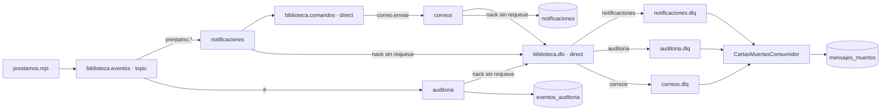

# Topología · biblioteca

| Exchange | Tipo | Cola | Binding | Caso de uso |
|---|---|---|---|---|
| biblioteca.eventos | topic | notificaciones | prestamo.* | Avisar al lector por creación/devolución |
| biblioteca.eventos | topic | auditoria | # | Persistir todos los hechos en eventos_auditoria |
| biblioteca.comandos | direct | correos | correo.enviar | Simular envío y guardar Notificacion |
| biblioteca.dlx | direct | notificaciones.dlq | notificaciones | Apartar avisos fallidos |
| biblioteca.dlx | direct | auditoria.dlq | auditoria | Apartar eventos que no se pudieron guardar |
| biblioteca.dlx | direct | correos.dlq | correos | Apartar comandos de correo fallidos |

| Routing key | Productor | Payload |
|---|---|---|
| prestamo.creado | prestamos.mjs, después del INSERT | { prestamoId, libroId, usuarioSub, hasta } |
| prestamo.devuelto | prestamos.mjs, después del UPDATE | { prestamoId, libroId, usuarioSub } |
| libro.agotado | Emisión manual del laboratorio | { libroId } |
| correo.enviar | NotificacionesConsumidor | { para, asunto, cuerpo, origen, eventoId } |

Todos los mensajes publicados llevan persistent=true, contentType=application/json,
x-evento-id (UUID) y x-emitido-en (instante ISO). El eventoId del cuerpo de correo.enviar
referencia el evento original; x-evento-id del comando identifica esa publicación nueva.

Todas las colas/exchanges son durables. Cada cola de trabajo declara
x-dead-letter-exchange=biblioteca.dlx y x-dead-letter-routing-key=su nombre.
Las DLQ no tienen DLX, para evitar ciclos.
Orden de declaración: exchanges, DLQ con bindings, colas de trabajo, bindings de trabajo.

Un prestamo.creado roto genera dos copias rechazadas: coincide con prestamo.* y #.
El broker agrega x-death (cola, motivo, count, routing-keys y exchange).
La cola original se obtiene de x-first-death-queue; la routing key original de x-death[0].
